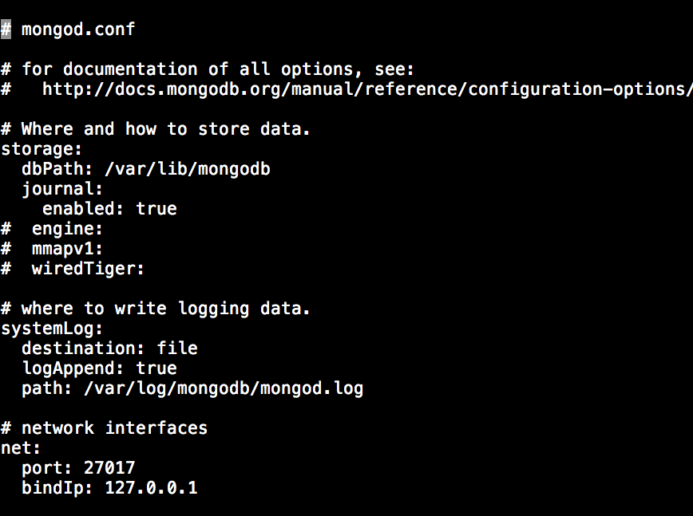

## Tutorial de MongoDB.

### 1. Introducción.

MongoDB es una base de datos orientada a documentos. Esto quiere decir que en lugar de guardar los datos en registros, guarda los datos en documentos. Estos documentos son almacenados en BSON, que es una representación binaria de JSON. La diferencia fundamental con las bases de datos relacionales es, que no es necesario seguir un esquema.
Por ejemplo:

	# Primer empleado.
	{name: "Pancho",
	edad: 24,
	puesto: "redactor"}

	# Segundo empleado.
	{name: "Fernando",
	edad: 30,
	salario: 3000,
	puesto: "Servicio técnico"}

Ventajas:
*	Su capacidad para escalar horizontalmente.
*	En el buen rendimiento que ofrece en general en las operaciones de lectura.
* En su capacidad para adaptarse a los cambios en la estructura de la información.
* En las posibilidades que ofrecen sus índices.
* La facilidad que ofrece para programar aplicaciones en muy diversos lenguajes.

Desventajas:
*	las características del mundo relacional que no implementa, por ejemplo, el JOIN. Sobre todo si trabajamos con información eminentemente relacional y que no varía.
* Las posibles mermas de rendimiento que pueden tener lugar en aplicaciones en las que las operaciones de escritura sean muy intensas.

### 2. Instalación.

MongoDB se encuentra disponible para Windows, Linux y Mac.

* [Instalación para Mac.](https://docs.mongodb.org/manual/tutorial/install-mongodb-on-os-x/)
* [Instalación para Ubuntu.](https://docs.mongodb.org/manual/administration/install-on-linux/)
* [Instalación para Windows.](https://docs.mongodb.org/manual/tutorial/install-mongodb-on-windows/)

### 3. Comandos esenciales

Para iniciar MongoDB en Linux:

	sudo service mongod start

Para detener la MongoDB:

	sudo service mongod stop

Reiniciar la MongoDB:

	sudo service mongod restart

El puerto por defecto en el que arranca es, 27017. El puerto es configurado en la ruta `/etc/mongod.conf`.

Para especificar la carpeta de datos se utiliza el siguiente comando:

	mongod --dbpath /Users/jose/Desktop/data

### 4. Comandos básicos de la consola.

Para arrancar la consola utilizaremos el siguiente comando:

	$ mongo

Es importante haber arrrancado el servicio con el comando especificado para ello en el punto 3.

#### 4.1	Insert

Insertar documentos es muy sencillo. Solo hay que conectarse la consola y escribir el comando:

	db.nombre_coleccion.insert(documento)

Un ejemplo sería:

	db.familia.insert({_id:1,name:"Carlos", parentesco:"Padre"} )

Insertar varios objetos a la vez (utilizaremos un array de documentos):

	db.familia.insert(
	[
	  {id_:2, name:"Claudia", parentesco:"Madre", nacionalidad:"Colombiana"},
	  {id_:3, name:"Joyce", apellido:"Giffuni", parentesco:"Hermana"}
	])

#### 4.2	Update

Para actualizar datos, podemos utilizar la sentencia *update*:

Por ejemplo:

	db.familia.update(
		{_id : 2},
		{name : "Claudia Liliana"}
	)

Después el resultado sería:

	{ "_id" : 2, "name" : "Claudia Liliana" }

Se puede ver, que MongoDB ha modificado el documento por completo.

##### 4.2.1	Para modificar el documento sin que nos cree uno nuevo, utilizaremos: *$set*

	db.familia.update(
		{_id:2},
		{$set:{name: Claudia Liliana}}
	)

El resultado es este:

	{ "_id" : 2, "name" : "Claudia Liliana", "parentesco" : "Madre" }

El *$set* también sirve para añadir un campo nuevo. Ejemplo:

	db.familia.update(
		{_id:1},
		{$set:{profesión:"médico"}}
	)

Dando como resultado:

	{ "_id" : 1, "name" : "Carlos", "parentesco" : "Padre", "profesión" : "Médico" }

##### 4.2.2 Para eliminar campos se usa el *$unset*

 Por ejemplo para eliminar el campo profesión utilizaríamos:

 	{$unset:{"profesión":""}}.

#### 4.3 El comando *find()*

La función *find* nos permite buscar documentos en una colección. Si no le pasamos ningún parámetro, se buscarán todos los elementos en la colección.

	db.familia.find()

Para hacer una búsqueda sesgada:
	db.familia.find({n_campo:"atributo"})

#### 5. Integración con node-js
Les remito a mi [página web.](https://tutorial-alu0100770551.herokuapp.com/tutorial/node/)

#### 6.	Enlaces recomendados para profundizar un poco más

[Encuentra tus datos con consultas simples](http://www.genbetadev.com/trabajar-como-desarrollador/mongodb-encuentra-tus-datos-con-consultas-simples)

[Otros modificadores útiles](http://www.genbetadev.com/bases-de-datos/mongodb-la-vida-cambia-tus-datos-tambien-operaciones-de-actualizacion-simples)

[Para profundizar más.](http://www.genbetadev.com/bases-de-datos/mongodb-la-vida-cambia-tus-datos-tambien-actualiza-subdocumentos-y-anade-datos-a-un-array)

[Creación y actualización de índices](http://www.genbetadev.com/bases-de-datos/mongodb-creacion-y-utilizacion-de-indices)

### Enlaces usados para hacer este tutorial

* [Curso de Rails](http://cursoderails.com/cuando-usar-mongodb)
*	[MongoDB: qué es, cómo funciona y cuándo podemos usarlo (o no)](http://www.genbetadev.com/bases-de-datos/mongodb-que-es-como-funciona-y-cuando-podemos-usarlo-o-no)
* [MongoDB: empezando por el principio. Insertando datos](http://www.genbetadev.com/bases-de-datos/mongodb-empezando-por-el-principio-insertando-datos)
* [MongoDB: la vida cambia, tus datos también. Operaciones de actualización simples](http://www.genbetadev.com/bases-de-datos/mongodb-la-vida-cambia-tus-datos-tambien-operaciones-de-actualizacion-simples)
